# CI/CD Pipeline with Tekton

A hands-on project completed as part of IBM's **Introduction to CI/CD** course (part of the [IBM Hybrid Cloud Architect Professional Certificate](https://www.coursera.org/professional-certificates/ibm-hybrid-cloud-architect) on Coursera).

## What this project demonstrates

Built a parameterized, multi-stage CI/CD pipeline using **Tekton**, a Kubernetes-native CI/CD framework and a [CNCF](https://www.cncf.io/) project. This project covers:

- Authoring Tekton **Tasks** and **Pipelines** as YAML (pipeline-as-code)
- Parameterizing Tasks and Pipelines so they're reusable rather than hardcoded
- Chaining pipeline stages in a defined order using `runAfter`
- Cloning a Git repository as a pipeline step, using a custom container image
- Structuring a pipeline to mirror a real CI/CD workflow: clone → lint → test → build → deploy

> **Note:** The `lint`, `tests`, `setup-maven`, `build`, and `deploy` stages in the final pipeline echo placeholder messages rather than running real linting, testing, or build tools. The focus of this project was pipeline **structure, sequencing, and parameterization** — the actual tooling integration (a real linter, test runner, etc.) would replace these placeholder steps in a production pipeline.

## Build progression

**1. Base Task** — a single Tekton Task that echoes a hardcoded message.
```yaml
apiVersion: tekton.dev/v1beta1
kind: Task
metadata:
  name: hello-world
spec:
  steps:
    - name: echo
      image: alpine:3
      command: ["/bin/echo"]
      args: ["Hello World"]
```

**2. Base Pipeline** — a Pipeline referencing that Task via `taskRef`.
```yaml
apiVersion: tekton.dev/v1beta1
kind: Pipeline
metadata:
  name: hello-pipeline
spec:
  tasks:
    - name: hello
      taskRef:
        name: hello-world
```
Ran with: `tkn pipeline start --showlog hello-pipeline` → output: `[hello : echo] Hello World`

**3. Parameterized the Task and Pipeline** — renamed the Task to `echo`, added a `message` parameter to both the Task and the Pipeline, and passed the value through from Pipeline to Task using `$(params.message)`.

Ran with a custom message: `tkn pipeline start hello-pipeline --showlog -p message="Hello Tekton!"` → output: `[hello : echo-message] Hello Tekton!`

**4. Added a `checkout` Task** — a second Task using the `bitnami/git:latest` image to run `git clone`, parameterized with `repo-url` and `branch`.

**5. Built a `cd-pipeline`** — a new Pipeline with `repo-url` and `branch` (defaulted to `"master"`) parameters, referencing the `checkout` Task to clone a live repository.

Ran with: `tkn pipeline start cd-pipeline --showlog -p repo-url="<repo-url>" -p branch="main"` → successfully cloned the target repository as the first pipeline stage.

**6. Extended the pipeline into a full CI/CD sequence** — added `lint`, `tests`, `setup-maven`, `build`, and `deploy` stages, each referencing the `echo` Task and chained in order using `runAfter`, so each stage only runs after the previous one completes successfully.

## Final pipeline structure

```
clone → lint → tests → setup-maven → build → deploy
```

Each stage after `clone` uses the `echo` Task to represent where real tooling (a linter, test runner, Docker build, deployment step) would plug in — the pipeline's sequencing, parameter passing, and dependency structure are fully functional and match a real-world CI/CD flow.

## Full pipeline run output

```
[clone : checkout] Cloning into 'miksg-ci-cd_Practicecode_j'...
[lint : echo-message] Linting code with CheckStyle...
[tests : echo-message] Running unit tests with Junit...
[setup-maven : echo-message] Setting up Maven...
[build : echo-message] Building image for https://github.com/ibm-developer-skills-network/miksg-ci-cd_Practicecode_j.git ...
[deploy : echo-message] Deploying main branch of https://github.com/ibm-developer-skills-network/miksg-ci-cd_Practicecode_j.git ...
```

## Screenshots

| Step | Screenshot |
|---|---|
| Cloning the lab starter repo | 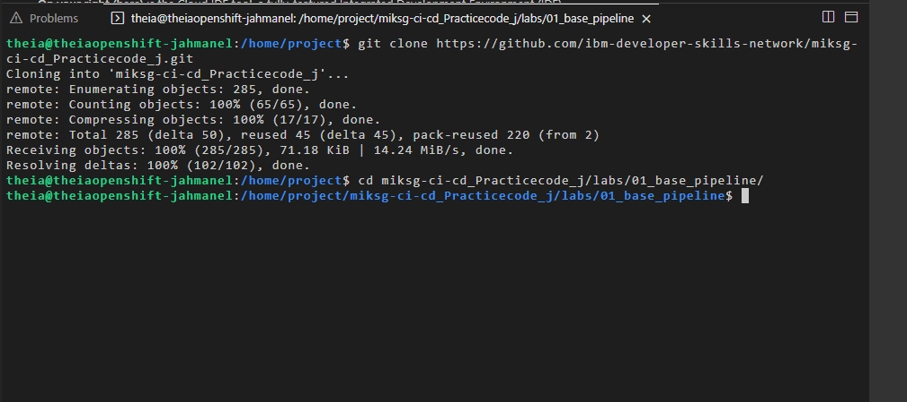 |
| Base Task template | 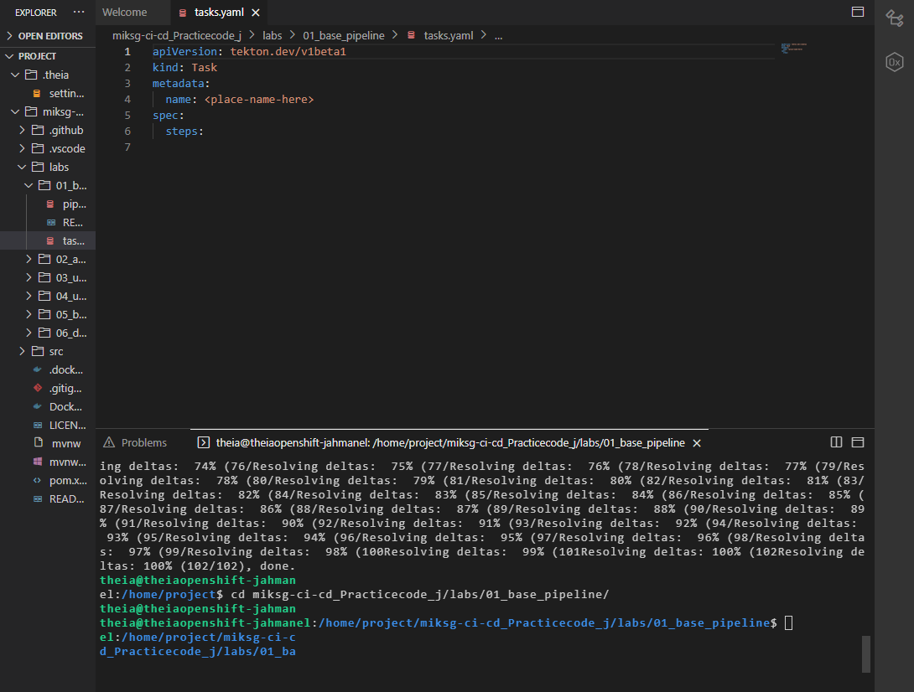 |
| `hello-world` Task created | 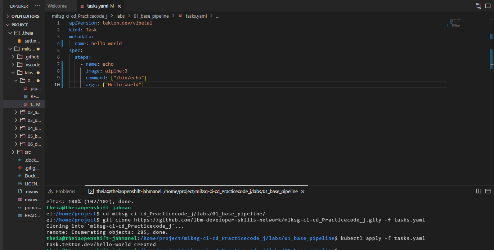 |
| Base Pipeline template | 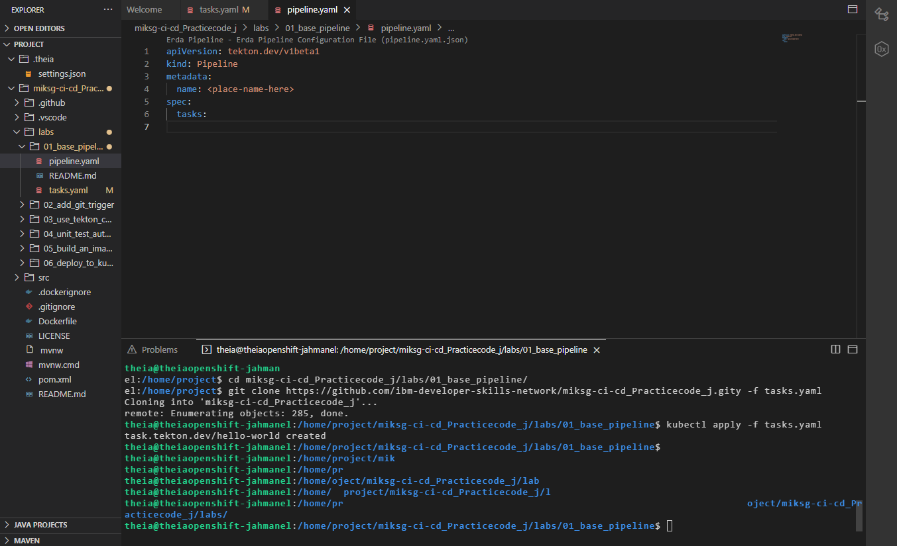 |
| `hello-pipeline` created | 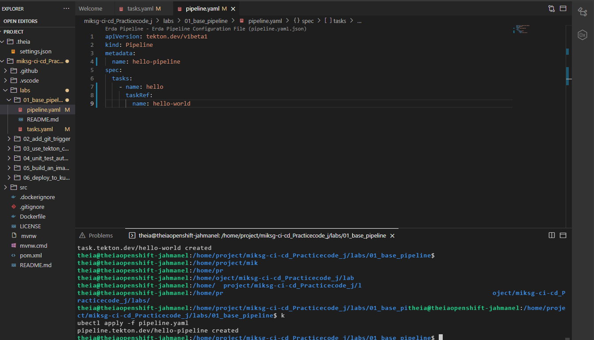 |
| First pipeline run | 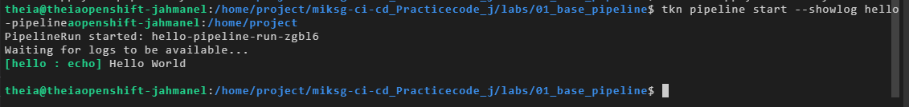 |
| `echo` Task parameterized | 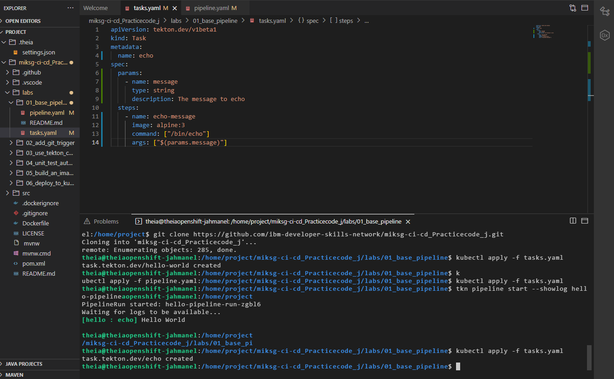 |
| Pipeline parameterized | 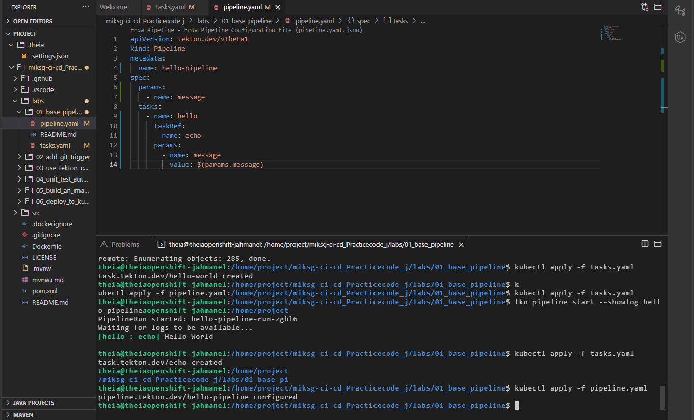 |
| Pipeline run with custom message | 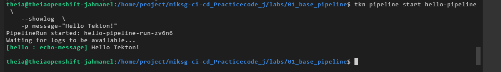 |
| `checkout` Task added | 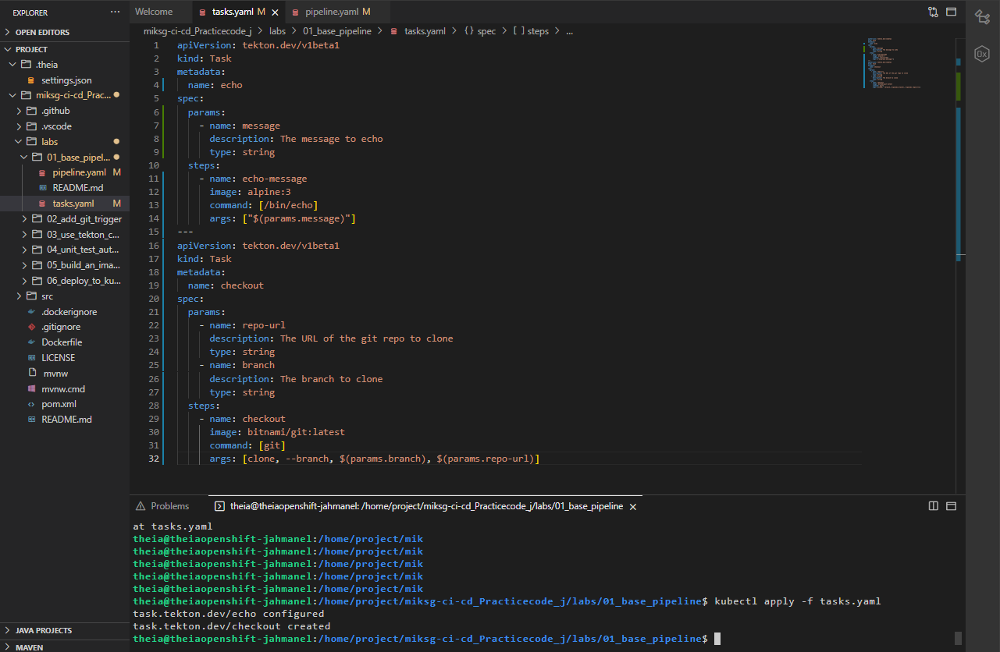 |
| `cd-pipeline` with clone stage | 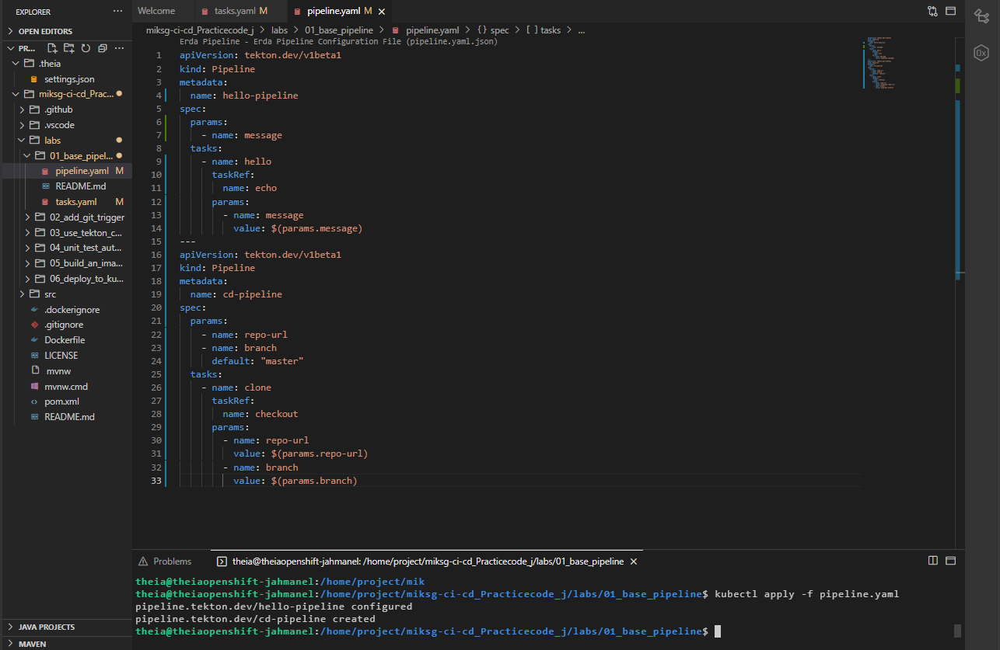 |
| Pipeline run cloning a real repo | 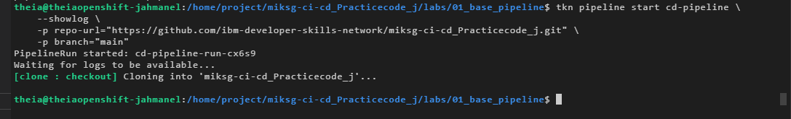 |
| Full CI/CD pipeline with all stages | 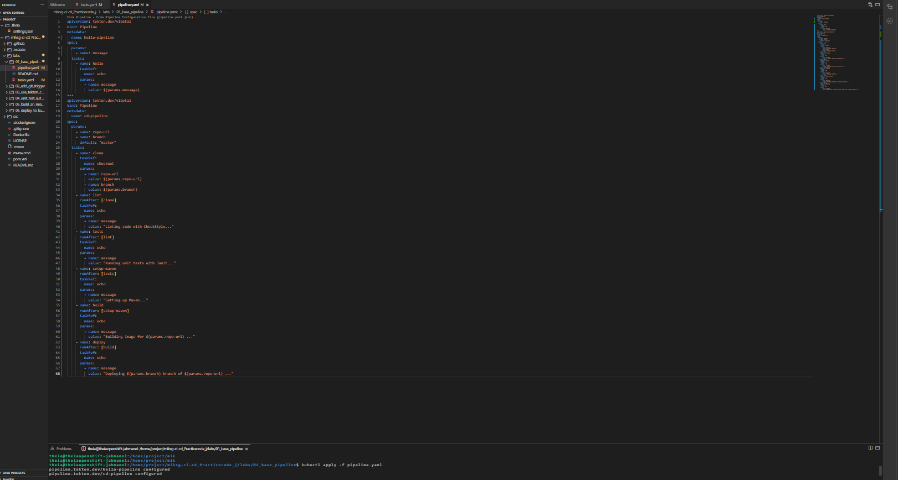 |
| Full pipeline run, all stages passing | 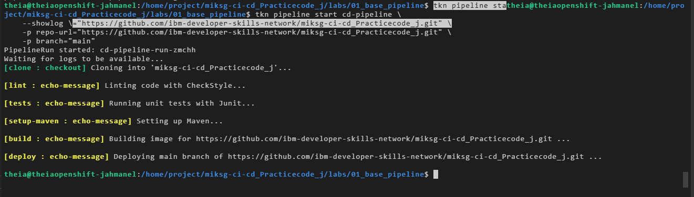 |

## Tech used

`Tekton` · `Kubernetes` · `YAML` · `CI/CD` · `Pipeline-as-Code` · `Git`

## Credit

Lab exercise structure and starter files provided by IBM's Skills Network as part of the Introduction to CI/CD course. The Task definitions, Pipeline definitions, and their parameterization were authored by me as part of completing this lab.

---

*Elijah Cordova — working toward a DevOps/Cloud Engineering role. Part of my progress through the [IBM Hybrid Cloud Architect Professional Certificate](https://www.coursera.org/professional-certificates/ibm-hybrid-cloud-architect).*
